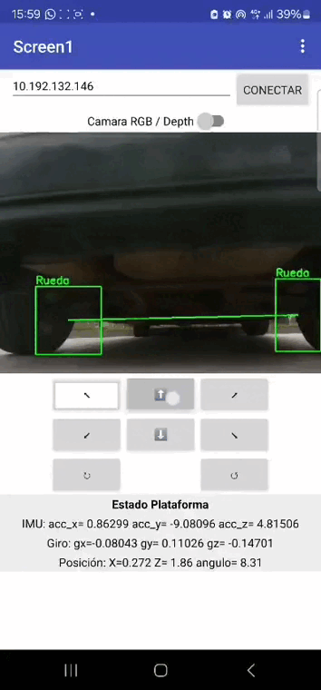

# Under-Vehicle Inspection Robot (TFM)

Teleoperated mobile robot designed for **under-vehicle inspection**, combining:
- Real-time **teleoperation** (Android app + Arduino controller)
- **RGB/Depth streaming** (Intel RealSense)
- **On-device object detection** (OpenVINO + ONNX) for safety-related items (wheels, backpacks, weapons)
- **Relative position & yaw estimation** based on the closest detected wheel pair

## Demo




## Repository structure
- `src/server/teleop_server.py`: Teleoperation + streaming + perception server
- `arduino/`: Arduino firmware and wiring notes
- `mobile_app/`: Android app assets (APK / App Inventor project)
- `models/`: ONNX weights (or links to releases/LFS)

## Requirements
- Ubuntu 22.04 (recommended)
- Intel RealSense SDK
- Python 3.10+
- OpenVINO Runtime
- USB serial access to the Arduino board

## Quick start (server)
```bash
python3 -m venv .venv
source .venv/bin/activate
pip install -r requirements.txt

python src/server/teleop_server.py
```

Open:
- RGB stream: `http://localhost:8000/`
- Depth stream: `http://localhost:8000/view/depth`

## Teleoperation API
- `POST /cmd` JSON: `{ "accion": "adelante" }`
- `GET  /estado_plataforma` returns relative pose and IMU info
  
## Mobile Teleoperation App

The Android teleoperation application is available as a GitHub Release:

👉 https://github.com/Ronieva/under-vehicle-inspection-robot/releases

## Models
By default the server expects:
- `models/pesos_armas.onnx`
- `models/pesos_ruedas.onnx`
- `models/pesos_mochilas.onnx`

You can override paths using environment variables:
```bash
MODEL_RUEDAS=/path/to/model.onnx python src/server/teleop_server.py
```
## Third-Party Models

The weapon detection component uses a YOLOv8-based model exported from the
*Weapons and Knives Detection Using YOLOv8* repository by Joao Assalim:

- https://github.com/JoaoAssalim/Weapons-and-Knives-Detector-with-YOLOv8
- License: GPL-3.0

Only the trained model weights are used. No source code from the original
repository is included in this project.

The metrics of this model are reported by the original authors and are provided
for reference only. No additional training was performed.


## Notes
This project was developed as a Master's Thesis (TFM). The repository focuses on:
- System integration (sensing, inference, control)
- Reproducible deployment and clear documentation
- Real-time constraints and robust measurements using depth filtering

## License

This project is released under the MIT License.

Third-party models may be subject to their own licenses.
See the *Third-Party Models* section for details.

